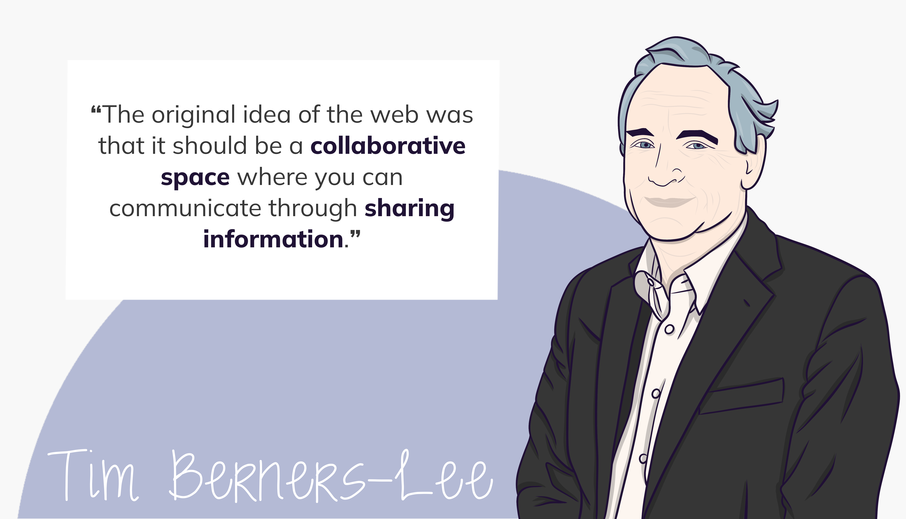
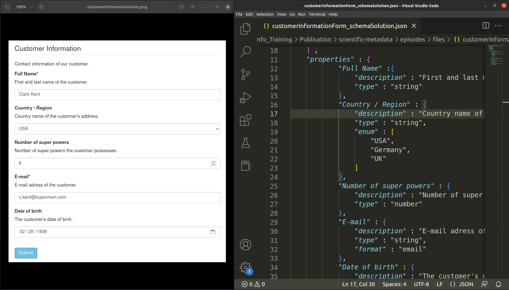
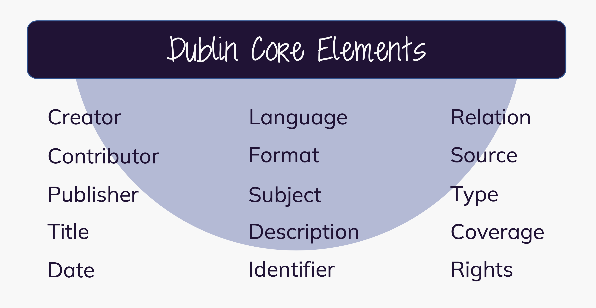

{alt="Quote by Tim Berners-Lee saying 'The original idea of the web was that it should be a collaborative space where you can communicate through sharing information.'"}
<br>

:::::::::::::::::::::::::::::::::::::: questions 

- What are the benefits of creating / using a metadata schema / standard?
- How do you find a suitable metadata standard or terminology for your research field online?

::::::::::::::::::::::::::::::::::::::::::::::::

::::::::::::::::::::::::::::::::::::: objectives

- Understand, read and write XML / JSON schema.
- Find research field specific metadata standards and terminologies.

::::::::::::::::::::::::::::::::::::::::::::::::


## The Web is not the internet

In 1989 researchers Tim Berners-Lee and Robert Cailliau started their HyperText project called the WWW (**W**orld-**W**ide **W**eb, short Web) at the CERN research center in Geneva, Switzerland. The Web was developed to "meet the demand for automated information-sharing between scientists in universities and institutes around the world".[^10]

The WWW is a service on the application layer of the internet protocol stack TCP/IP (**T**ransmission **C**ontrol **P**rotocol/**I**nternet **P**rotocol) -- invented by Vint Cerf and Robert (Bob) Elliot Kahn in the 1970s.

The World Wide Web main building blocks are:
- HTML markup language with "hyperlinks"
- HTTP (**H**yper**T**ext **T**ransfer **P**rotocol)
- URI (**U**niform **R**esource **I**dentifier)

HTML applies the ideas of HyperText and HyperMedia -- terms coined by [Ted Nelson](https://www.youtube.com/user/TheTedNelson/videos) in the 1960s:

<br>

> "a combination of natural language text with the computer's capacity for interactive branching, or dynamic display ... "\
> - <cite>[Ted Nelson](https://ieeexplore.ieee.org/document/1663693)</cite>

<br>

HTTP is a simple protocol that sets communication rules for client and server software on the World Wide Web. For URI see chapter [(Web) Location & Identifiers](#web-location-identifiers).

In 1992 Deutsches Elektronen-Synchrotron DESY in Hamburg connected a web server to the WWW. An even earlier adopter was the **arXiv preprint repository**. They switched from email to HTTP for manuscript dissemination in 1991.[^11]

So-called **web repositories** store and publish (scholarly) digital objects -- like paper publications and research data -- and their **metadata records**. This way, they aim to improve the persistent **findability and accessibility of research output.** Repositories in turn are indexed for findability in registry services like [https://www.re3data.org/](https://www.re3data.org/) and [https://v2.sherpa.ac.uk/opendoar/](https://v2.sherpa.ac.uk/opendoar/).

## Metadata Schemas
:::::::::::::::::::::::::::::::::::::::::::::::::::::::::::::::::::::::: callout 
**A metadata schema is a template** which exemplifies the metadata elements expected and how they should be structured.
::::::::::::::::::::::::::::::::::::::::::::::::::::::::::::::::::::::::::::::::

**XML Schemas (.xsd)** are written in XML and used to describe & syntactically validate the structure of XML documents or (meta)data records.[^12]

The [**JSON Schema vocabulary**](https://json-schema.org/){target="_blank"} is used to describe & syntactically validate the structure of JSON (meta)data records. We will focus on **JSON Schema** in our next hands-on task. Each JSON schema is a JSON object literal by itself.[^13] 
    
A simple JSON schema could look like the one below. It declares:
<ul>
  <li>JSON Schema version with `$schema`</li>
  <li>a list (an array) of required (i. e. mandatory) properties</li>
  <li>one required property (i.e. ``"superhero"``)</li>
  <li>one optional property (i.e. ``"power"``)</li>
  <li>data type constraints for record values (e.g. ``"type": "integer"``)</li>
</ul>
    
There are also some `descriptions` added for the human reader.

```json
{
  "$schema": "https://json-schema.org/draft/2020-12/schema",
  "description": "In real life you would add a meaningful description here.",
  "type": "object",
  "required": [
    "superhero"
  ],
  "properties": {
    "superhero": {
      "description": "A mandatory string property.",
      "type": "string"
    },
    "power": {
      "description": "An optional numeric property.",
      "type": "integer"
    }
  }
}

```
A JSON instance is syntactically valid, if it conforms to the definition described by the JSON schema. Note, that the JSON Schema `required` keyword holds a list of keys that must be present for a JSON object to be considered a valid instance of this schema.

```json
{
  "superhero": "I am just a string"
}
```

:::::::::::::::::::::::::::::::::::::::::::::::::::::::::::::::::::::::: callout 
The most challenging part of schema development can be to **have everyone agree on the same expectations.**
::::::::::::::::::::::::::::::::::::::::::::::::::::::::::::::::::::::::::::::::

::::::::::::::::::::::::::::::::::::::::::::::::::::::::::::::::::::: instructor
# Guided confrontation: Live coding a JSON schema

The concept of a schema can be overwhelming for learners with little to no prior knowledge. To prepare the learners for Challenge 4, we recommend to include an **interactive live coding session**. The following instructions and suggestions are based on the narrative we follow in our course set-up.

**Time**: 8 min

**Instructor material**: <br>
<ul>
  <li><a href="../../../episodes/files/customerInformationForm.png" target="_blank">customerInformationForm.png</a></li> 
  <li><a href="../../../episodes/files/customerInformationForm_solution.json" target="_blank">customerInformationForm_schemaSolution.json</a></li>
</ul>

**Creators recommendation**: <br>
<ul>
  <li>Introduce a customer information form as an example for data validation / enforcement in your lecture (see also: */include teaching script anchor/*).</li>
  <li>Open the image of the customer information form and an empty JSON file in **split-screen view**.</li>
</ul>
{alt="Screenshot of the recommended live coding session."}
<ul>
  <li>For live coding, we recommend using an **IDE** with **JSON syntax highlighting** (e.g. VS Code)</li>
</ul>

**Narrative / Teaching script**: <br>
<ul>
  <li>*start off with 2 indentations*</li>
  <li>demonstrate specifying the first property in the form `"Full Name"` by entering a meaningful `"description"` and `"type":"string"`</li>
  <li> encourage the learners to shout out the values (and keys), that specify the subsequent form properties.</li>
  <li> highlight the following aspects: </li>
    <ul>
      <li>`"Country/Region"`: to restrict a value to a fixed set of values, the keyword `"enum"` is used. Fixed values are specified in an `array` of unique elements.</li>
      <li>`"Number of super powers"`: introduce `"type":"number"`</li>
      <li>`"E-mail"`: introduce the `"format"`-keyword. `"format":"email"` validates against the correct formatting of an e-mail address (`someString` - `@-sign` - `domain name`). However, it does check, whether the e-mail address exists.</li>
      <li>`"Date of birth"`: specify `date`-format.</li>
    </ul>
  <li> **The specified keywords represent the `"properties"` of the `customerInformation`-object**</li>
  <li> the `"properties"`-key of a JSON schema object takes a value of data type `object` -> *enclose the specified field-objects in curly brackets*</li>
  <li> collaboratively define the JSON schema keys `"title"`, `"description"`, and `"type"`</li>
  <li> highlight, that a JSON schema is a **JSON object literal** -> *enclose the schema-object in curly brackets*</li>
  <li> Finally, draw the learners attention to the **mandatory** fields in the customer information form and introduce the `"required"`-keyword</li>
</ul>


::::::::::::::::::::::::::::::::::::::::::::::::::::::::::::::::::::::::::::::::

::::::::::::::::::::::::::::::::::::::::::::::::::::::::::::::::::::: instructor
## Challenge notes

The following challenges 4 & 5 will be processed **consecutively in groups of 5 - 6 learners**.
We made the experience, that changing the group composition for these tasks benefits the overall collaborative atmosphere. 

**Total time:** 30 min

**Implementation:** <br>
In accordance with challenges 2 & 3, we recommend using a pre-structured shared notes document with the gorups.

**Shared notes:** <br>
You can find an example Markdown file for the group handouts <a href="../../../episodes/files/exampleGroupHandout.txt" target="_blank">**HERE**</a>. This document is optimized for use in a Hedgedoc document. 

##### <u>Challenge 4: JSON Schema</u>

**Time:** 20 min

**Challenge type:** group activity, production

**Objective:** <br>
By writing a short excerpt of a JSON schema, the learner get familiar with the schema syntax, gain the ability to read and understand a schema, and get to know some important JSON schema keywords. By writing the schema in a group set-up, the learner experience the discussion process as a crucial part of schema development.

##### <u>Challenge 5: Form input & validation with JSON schema</u>

**Time:** 10 min

**Challenge type:** group activity **OR** individual exploration

**Objective:** <br>
By downloading and inspecting the final JSON schema, the learners comprehend the complexity a metadata schema can acquire. With the implementation of the schema in the UI of the react-jsonschema-form playground, the learners bring the developed schema into use, get to know a software tool, they can benefit from, and experience relieve of the frustration after Challenge 3.

::::::::::::::::::::::::::::::::::::::::::::::::::::::::::::::::::::::::::::::::

:::::::::::::::::::::::::::::::::::::::::::::::::::::::::::::::::::::: challenge
## Challenge 4: JSON Schema
    
After a couple of researchers upload their JSON metadata records to the project repository it becomes obvious that well-formed JSON metadata describing similar experiments can still be expressed in myriad ways.

Your collaboration decides to develop a metadata schema to standardize metadata records across the project. Consensus is encoded in a JSON Schema.

**Now its your task to help with the subschema for experimental conditions!**

In the following **code block** you see valid JSON metadata that describes experimental conditions as agreed on in the project.
<br>

```json
{
  "experimentalConditions": {
    "ride": {
      "rideType": "roller coaster",
      "rideName": "Flight of the Bat",
      "location": "Gotham City, New Jersey"
    },
    "testPerson": {
      "sex": "male",
      "height": 180
    },
    "recording": {
      "testDevice": "iPhone X",
      "testDeviceFixture": "left upper arm",
      "testApp": "Physics Toolbox Suite by Vieyra Software"
    }
  }
}
```

In the following code block you see the JSON schema draft for the experimental conditions. Your collaborators already modelled constraints and valid values for `ride` and `testPerson`.<br>

**Discuss and add constraints to `recording` property.**

- `testDevice`, `testDeviceFixture` and `testApp` are **mandatory properties** for the **`recording`** object
- **`testDevice`** value must be one of:
    - `iPhone X`
    - `iPhone 6`
    - `iPhone 6s`
    - `other`
    
- **`testApp`** value must be one of:
    - `Physics Toolbox Suite by Vieyra Software`
    - `Bunny Rollercoaster Physics App`
    
- **`testDeviceFixture`** value must be one of:
    - `left upper arm`
    - `right upper arm`
    - `mouth fixture device`
    - `other`
<br>

```json
{
  "experimentalConditions": {
    "description": "A summary of the experimental conditions. Include sufficient detail to facilitate search and discovery.",
    "type": "object",
    "required": [
      "recording",
      "ride",
      "testPerson"
      ],
    "properties": {
    
      "recording": {
      /* Insert your schema here and delete this comment */
        },
      
      "ride": {
        "description": "Properties of the ride.",
        "type": "object",
        "required": [
          "rideType",
          "rideName"
        ],
        "properties": {
          "rideType": {
            "description": "Ride type.",
            "type": "string",
            "enum": [
              "roller coaster",
              "water slide",
              "bob sled"
            ]
          },
          "rideName": {
            "description": "Official name of the ride.",
            "type": "string",
            "minLength": 3
          },
          "location": {
            "description": "City and State in which ride is located.",
            "type": "string",
            "minLength": 10
          }
        }
      }
    },
    "testPerson": {
      "description": "Properties of person carrying the test device.",
      "type": "object",
      "required": [
        "height",
        "sex"
      ],
      "properties": {
        "height": {
          "description": "Height of test person in cm (SI unit of length).",
          "type": "number",
          "minimum": 120,
          "exclusiveMaximum": 220
        },
        "sex": {
          "description": "Sex of test person.",
          "type": "string",
          "enum": [
            "female",
            "male",
            "non-binary",
            "not disclosed"
          ]
        }
      }
    }
  }
}
```

::::::::::::::::::::::::::::::::::::::::::::::::::::::::::::::::::::::: solution
```json
{
    "experimentalConditions": {
        "description": "A summary of the resource. Include sufficient detail to facilitate search and discovery.",
        "type": "object",
        "required": [
            "recording",
            "testObject"
            "testPerson"
            ],
        "properties": {
            
            */ add your schema here /*
            "recording": {
                "description": "",
                "type": "object",
                "required":[
                    "testApp",
                    "testDevice",
                    "testDeviceFixture"
                    ],
                "properties": {
                    "testApp": {
                        "description": "Test app used.",
                        "type": "string",
                        "enum": [
                            "Physics Toolbox Suite by Vieyra Software",
                            "Bunny Rollercoaster Physics App"
                            ]
                        },
                    "testAppVersion": {
                        "description": "Version of test app (free text input). Full semantic versioning input preferred: Major.minor.bugfix",
                        "type": "string",
                        "minLength": 1
                        },
                    "testDevice": {
                        "description": "Test device used.",
                        "type": "string",
                        "enum": [
                            "iPhone X",
                            "iPhone 6",
                            "iPhone 6s",
                            "other"
                            ]
                        },
                    "testDeviceFixture": {
                        "description": "Test device fixture.",
                        "type": "string",
                        "enum": [
                            "left upper arm",
                            "right upper arm",
                            "mouth fixture device",
                            "other"
                            ]
                        }
                    }   
                },
                
            */ this part was prepared by your collaborators /*
            "testObject": {
                "description": "A free text abstract of the experimental setup.",
                "type": "object",
                "required": [
                    "rideType",
                    "rideName"
                    ],
                "properties": {
                
                    "rideType": {
                        "description": "Specification of ride type of the tested object",
                        "type":"string",
                        "enum": [
                            "roller coaster",
                            "water slide",
                            "bob sled"
                            ]
                        },
                        
                    "rideName": {
                        "description": "Official name of the ride.",
                        "type": "string",
                        "minLength": 1
                        },
                        
                    "location": {
                        "description": "City and State in which the ride is located",
                        "type": "string"
                    }
                },
                
            "testPerson": {
                "description": "Information about the subject carrying the test device.",
                "type": "object",
                "required": [
                    "height",
                    "sex"
                    ],
                "properties": {
                
                    "height": {
                        "description": "The height of the test person in cm (SI unit of length).",
                        "type": "number",
                        "minimum": 120,
                        "exclusiveMaximum": 220
                        },
                        
                    "sex": {
                        "description": "The sex of the test person.",
                        "type": "string",
                        "enum": [
                            "female",
                            "male",
                            "not disclosed"
                            ]
                        }
                    }
                }
        }
```
::::::::::::::::::::::::::::::::::::::::::::::::::::::::::::::::::::::::::::::::
::::::::::::::::::::::::::::::::::::::::::::::::::::::::::::::::::::::::::::::::

:::::::::::::::::::::::::::::::::::::::::::::::::::::::::::::::::::::: challenge
## TASK 5: Form input & validation with JSON schema

**Congratulations, you finished your metadata schema!
Now, collecting interoperable metadata will be a lot easier in your collaboration.**

We must admit: writing a valid JSON metadata record for each and every experiment that you perform is tedious and time consuming. But now that you have a JSON Schema at hand, things will get a lot easier! The project sets up a user-friendly HTML form interface for the input of JSON metadata.

**Let's try this**:
<ul>
  <li>Download the full JSON schema <a href="../../../episodes/files/exampleDataObject_schema.json" target="_blank">**HERE**</a></li>
  <li>Inspect the JSON schema briefly</li>
  <li>In your browser go to [react-jsonschema-form playground](https://rjsf-team.github.io/react-jsonschema-form/){target="_blank"}.</li> 
  <li>Delete sample content in `JSONschema` and `formData`</li>
  <li>Copy and paste the full schema into the `JSONschema` box</li>
  <li>Check again if Chuck Norris properties reappeared in `formData` results; he can be tough :smile:</li>
  <li>Inspect the form interface thoroughly.</li>
  <li>**Optional:** Copy the final JSON object literal in `formData` in a separate text document and save the file as `exampleDataObject.json`</li> 
</ul>  
::::::::::::::::::::::::::::::::::::::::::::::::::::::::::::::::::::::::::: hint
## Good to know
Note that the JSON Schema used for this demo **lacks the recommended `$schema` keyword**: this is because the playground will reject the keyword.
::::::::::::::::::::::::::::::::::::::::::::::::::::::::::::::::::::::::::::::::

::::::::::::::::::::::::::::::::::::::::::::::::::::::::::::::::::::::::::::::::

::::::::::::::::::::::::::::::::::::::::::::::::::::::::::::::::::::: instructor
## Discussion notes

**Time:** 10 min

**Implementation:** <br>
<ul>
  <li>share the [react-jsonschema-form playground](https://rjsf-team.github.io/react-jsonschema-form/){target="_blank"} pre-filled with the final schema and metadata values in your browser **OR**</li>
  <li>share the final **JSON schema** on your screen **OR**</li>
  <li>display the final **JSON metadata records** (`exampleDataObject.json`) of each group next to each other</li>
</ul>

**Objective:** <br>
The learners are aware of the advantages of a metadata schema and metadata record validation, pay attention to interface interpretations in the proposed tool and feel relieve of the frustration experienced after challenge 3 based on the metadata record harmonization.

::::::::::::::::::::::::::::::::::::::::::::::::::::::::::::::::::::::::::::::::

::::::::::::::::::::::::::::::::::::::::::::::::::::::::::::::::::::: discussion
## Plenary result discussion

<ul>
  <li>How does the browser display lists of pre-defined values (specified as `enum` in the schema)?</li>
  <li>How are `arrays` and `objects` interpreted in the form interface?</li>
  <li>What happens if you enter an invalid value (e.g. try to enter a string for the test persons `height`)</li>
  <li>What happens if you enter a nonsense value (e.g. try to enter a nonsense string for `rideName`)</li>
  <li>How does the web service respond if you click on submit without filling all the "required" fields?</li>
</ul>
    
::::::::::::::::::::::::::::::::::::::::::::::::::::::::::::::::::::::::::::::::

::::::::::::::::::::::::::::::::::::::::::::::::::::::::::::::::::::: instructor
## Break :coffee:

We recommend a **15 min break** at this point.
::::::::::::::::::::::::::::::::::::::::::::::::::::::::::::::::::::::::::::::::

## Metadata Standards

:::::::::::::::::::::::::::::::::::::::::::::::::::::::::::::::::::::::: callout 
A well **established metadata schema** can become a standard.
::::::::::::::::::::::::::::::::::::::::::::::::::::::::::::::::::::::::::::::::

Researchers, librarians and web technologists drafted the **Dublin Core** -- a set of 15 library-card-catalog-like metadata elements for the web -- in 1995 at a meeting in Dublin, Ohio (USA).[^14]

Dublin Core and its extensions are widely used and referenced today. The [Dublin Core Metadata Initiative (DCMI)](https://www.dublincore.org/about/){target="_blank"} states to work openly, with a paid-membership model.

The 15 generic Dublin Core metadata elements have been formally standardized for cross-domain resource description in e.g. **ISO 15836-1:2017**[^15]

{alt="Depiction of the 15 Dublin Core Elements: Creator, Contributor, Publisher, Title, Date, Language, Format, Subject, Description, Identifier, Relation, Source, Type, Coverage, Rights"}

Many scholarly repositories expose a standardized **application programming interface (API)** for the harvesting of Dublin Core metadata as specified in [ http://www.openarchives.org/OAI/2.0/openarchivesprotocol.htm#dublincore](http://www.openarchives.org/OAI/2.0/openarchivesprotocol.htm#dublincore){target="_blank"}. 

::::::::::::::::::::::::::::::::::::::::::::::::::::::::::::::::::::: instructor
## Challenge notes

**Time:** 30 min

**Challenge type:** individual exploration, guided confrontation

**Objective:** <br>
The learners are aware of metadata standard registries and know how to navigate them.

**Creator's recommendation:** <br>
After giving the challenge instructions, allow for some time for the learners to explore the registries (ca. 15 min). Start a screen share of one on the metadata registries and navigate to a metadata standard of your liking. Talking points could be:
<ul>
  <li>different representations of metadata standards (JSON / XML schema, RDF, SKOS, OWL)</li>
  <li>granularity of representation (e.g. high level standard vs. application specific standard)</li>
  <li>terms, properties, specifications</li>
  <li>accompanying journal publications</li>
</ul>

**Transition to "(Web) Locations & Identifiers":**
During the discussion, ask the group of learners, whether someone encountered a `404 Error` while exploring a metadata standard. If you are working with a heterogeneous group in regard of their scientific background, chances are high, that at least one of the learners made this experience (-> it is not unusual that research field specific metadata standard development was concluded and the maintenance of the web representation was terminated with the end of the funding period.)

::::::::::::::::::::::::::::::::::::::::::::::::::::::::::::::::::::::::::::::::

:::::::::::::::::::::::::::::::::::::::::::::::::::::::::::::::::::::: challenge
## Challenge 6: Domain specific metadata standards

1. Open one of these metadata standard registries in your preferred browser: <br> [FAIRsharing.org](https://fairsharing.org/search?fairsharingRegistry=Standard){target="_blank"}<br>
[RDA Metadata Standards Catalog](https://rdamsc.bath.ac.uk/){target="_blank"}<br>
[DCC List of Metadata Standards](https://www.dcc.ac.uk/guidance/standards/metadata/list){target="_blank"}
3. Search for a metadata schema, standard or vocabulary **relevant to your research domain**.
4. Inspect the **information provided**.

::::::::::::::::::::::::::::::::::::::::::::::::::::::::::::::::::::::::::::::::


::::::::::::::::::::::::::::::::::::: keypoints 

- The WWW was developed in a **research context** to connect researchers worldwide and enable **sharing information**
- Metadata schemas serve as **template** and **validation matrix** for metadata records 
- JSON schemas are **JSON object literals**
- Well-established metadata schemas have the potential to become a (community) **standard**

::::::::::::::::::::::::::::::::::::::::::::::::

[^10]: https://home.cern/science/computing/birth-web
[^11]: https://ar5iv.labs.arxiv.org/html/1709.07020
[^12]: "XML Schema Tutorial". (C) 1999-2022. Refsnes Data, W3Schools. https: //www.w3schools.com/xml/schema_intro.asp
[^13]: "Understanding JSON Schema. The basics", © Copyright 2013-2016 Michael Droettboom, Space Telescope Science Institute; Last updated on Feb 07, 2022. https://json-schema.org/understanding-json-schema/basics.html
[^14]: https://www.dublincore.org/resources/metadata-basics/
[^15]: https://www.iso.org/standard/71339.html
