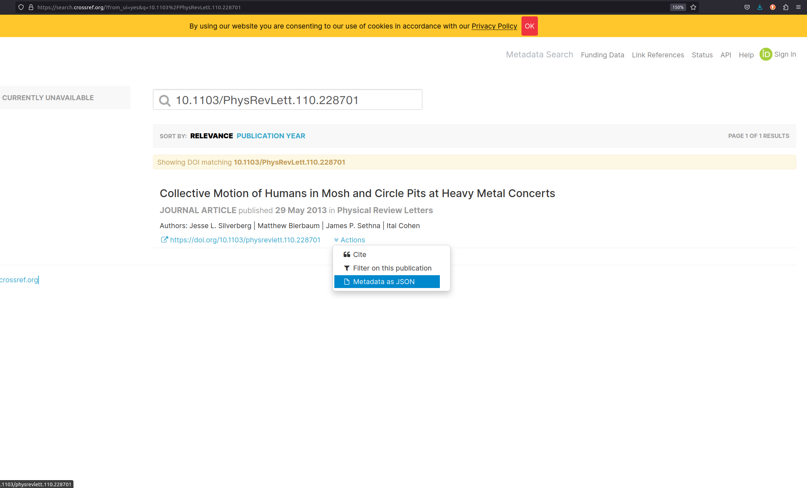

{alt="Quote from the Book Vanishing Act: The Erosion of Online Footnotes and Implications for Schlolarship in the Digital Age by Daniela Dimitrova and Michael Bugeja, saying 'Vanishing online footnotes undermine the building blocks of research, and their disappearance raises concerns about the reliability and replicability of scholarship.'"}

:::::::::::::::::::::::::::::::::::::: questions 

- What are PIDs?
- What are the differences between URL, URI and PID?
- Which PIDs are connected to the research context?
- How are PIDs used in metadata records?

::::::::::::::::::::::::::::::::::::::::::::::::

::::::::::::::::::::::::::::::::::::: objectives

- Explain basic concept of client-server communication.
- Explain differences between URL, URI and PID(s).
- Name examples of PIDs relevant for the research context.
- Familiarize with usage of URLs and PIDs in metadata records.

::::::::::::::::::::::::::::::::::::::::::::::::


## The Web of Today

::::::::::::::::::::::::::::::::::::::::::::::::::::::::::::::::::::: instructor
## Group activity: PID poll

**Time estimate**: 2 min

*Up to this point, the lesson followed a consistent silver lining. In the last episode, the learners "finished" annotating the example data. The following episode on (persistent) identifiers might seem somewhat disconnected to the previous lesson content at first before the connection is drawn to PIDs in metadata records. Therefore, we like to start off this episode with a quick live poll on PIDs in the scientific content. Together with the previous discussion on 404 Errors during the search for scientific metadata standards, this will prepare the learner for and engage them in the following content.*:smile:.

**Creators' recommendation:**<br>
We use [AHA slides](https://ahaslides.com/){target="_blank"} for live polling. Share the link to the poll with the learners and open the presentation mode of the poll on your shared screen.

**QUESTION:** Which of these terms do you know? Do any of these ring a bell? 

- DOI
- ORCID
- ROR
- URN
- URL
- URI

<a href="../../docs/files/exampleAhaslidesPid.png" target="popup" onclick="window.open('../docs/files/exampleAhaslidesPid.png,'popup','width=1200'); return false;" onMouseOver="document.PIDpoll.src='../../docs/files/CLICKexampleAhaslidesPid.png';" onMouseOut="document.PIDpoll.src='../../docs/files/exampleAhaslidesPid.png';">

</a>

(*As you can see in the example image above, DOI and ORCID are usually the best known PIDs among the learners. Take a few moments, to comment and reflect on the polling results.*)

::::::::::::::::::::::::::::::::::::::::::::::::::::::::::::::::::::::::::::::::

::::::::::::::::::::::::::::::::::::::::::::::::::::::::::::::::::::: instructor
## Lecture: The Web of Today

**Slide set**: [TheWebOfToday.pdf](../files/slideSet/17_TheWebOfToday_CarpentriesIncubator_ScientificMetadata.pdf){target="_blank"}

**Time estimate**: 4 min

1. Let’s get back to the World Wide Web.
2. Today we take a look at the Web and all information stored on it, that we carry in our pockets.
3. It accompanies us throughout the day. Streaming your favorite show, looking for recipes, shopping, banking, connecting with friends – the internet and the Web are involved in a large share of our daily activities.
4. Going back to the roots of the World Wide Web, it’s original idea was “to be a collaborative space where you can communicate through sharing information”.
5. And we are sharing information and communicating more than ever. Everything in the blink of an eye. The World Wide Web is now an essential tool for every researcher. Reading publications, connecting with other scientists, retrieving and publishing data, accessing servers on the other side of the globe, and even attending conferences and meetings with people hundreds and thousands of miles away from you. In the sense of the original idea of the Web, science became faster and communicating information easier. Its means to access information are so manifold, that retrieving relevant and meaningful information comes with new challenges.
6. The Web is a hypermedia system, connecting a multitude of resources via hyperlinks. We have already heard the term **resource** earlier and in the next couple of minutes we will get a bit more technical, talking about data retrieval on the Web and Web resources. So let’s define briefly, what the term **Web Resource** actually means.
7. A Web resource can be digital in nature, such as computer code, documents, videos, and images. These resources can immediately be retrieved or viewed on the Web in a browser.
8. But the term **Web resource** encompasses more than just digital resources. Physical and abstract entities, for example persons, art, buildings, and mathematical concepts are also Web resources once they are somehow represented on the Web.
9. Hence, any entity - digital, physical or abstract - that is represented on the Web is a Web resource.

::::::::::::::::::::::::::::::::::::::::::::::::::::::::::::::::::::::::::::::::

The Web today is build for human understanding and has taken over a large part of our personal and professional lives. As scientists the World Wide Web has become an essential tool for us to conduct research.

The World Wide Web is a **hypermedia system**. It contains:

- **Resources:** A web resource is any entity (digital, physical or abstract), that is represented on the Web.
- **Links:** (Web identifiers) between these resources.


## Web Identifiers

::::::::::::::::::::::::::::::::::::::::::::::::::::::::::::::::::::: instructor

## Lecture: Identifiers and Web Locations

**Slide set**: [IdentifierWebLocations.pdf](../files/slideSet/18_IdentifierWebLocations_CarpentriesIncubator_ScientificMetadata.pdf){target="_blank"}

**Time estimate**: 14 min

1. In yesterday’s lecture on the origins of the World Wide Web, we had a brief glimpse at the building blocks of the web. 
2. We have discussed Markup Languages yesterday morning as means to communicate representation and structure of a text document to the machine.
3. This lecture will focus on the other two essential building blocks of the web’s technological backbone.
4. Remember the first lecture from yesterday? We have had a close look on the metadata in a book. Now if a librarian wants to identify a specific publication...
5. they will use its ISBN for unambiguous identification. This ISBN follows a standardized structure, which gives valuable information about the resource, such as the group and publisher of the book. This ISBN is globally unique. Which means it only exists for one specific book and will always lead to the same result, where ever you retrieve it.
6. And these uniform resource identifiers also exist in the scientific context. Let me give you an example from molecular biology. Let's say, this scientist is working on genetics and she is interested in the functions of a specific gene in the model plant...
7. *Arabidopsis thaliana*. Every gene of this plant has an unique identifier assigned, that follows certain representative conventions. In the case of this model plant, the gene identifier holds information on the species, the chromosome, the type of sequence as well as its location on the chromosome. 
8. To generalize, unique identifiers enable globally unique identification of a resource. The structure of these identifiers is standardized and they are registered centrally, enabling a uniform structure of these identifiers globally or in the user community. This makes unique identifiers unambiguous and dereferencable.
9. (*Use this slide to collect unique identifiers in the research fields of the learners. We like to do this in a brief plenary discussion, asking the learners to share unique identifiers, they use regularly and what they represent.*)
10. Now we will take this concept of uniform identifiers to the Web.
11. But first, we will need to define and distinguish between a few terms, that come up frequently in this context. The examples we have seen a couple of minutes ago, are - simply put - a series of structurally harmonized characters that uniquely identify a resource...
12. The ISBN number we have seen, is basically just a "synonym" for a book. (It acts to the book like a synonym acts to another word). This is, what we call a URN, Uniform Resource **Name**. We know, what the resource is called. 
13. This name under a certain namespace, is uniform and unique. But the name gives no clue, on how we can retrieve the information stored behind this name. We do not know it’s location and the technical necessities to access it.
14. To do so on the web, we need the address...
15. where we can find the resource with a specific resource. The address alone is not enough, though. We also need information on how we can retrieve the resource...
16. This is specified by the communication protocol. We will focus on this technology in a minute. These information are given as a Uniform Resource Locator, URL: a series of characters, that specify the address of a resource and the protocol necessary to retrieve this resource.
17. Both, URN and URL, can be used to identify a specific resource. You either need the name or the location, to identify data on the Web. So URN and URL **are** Uniform Resource Identifiers.
18. We will further focus on URLs and the technology hidden behind this string of characters, that we enter to open a resource on the Web.
19. And for this we take the URL that retrieves the information for our gene example from couple of minutes ago. So let's decode this character set: The resource we are looking for, is...
20. provided on a specific server, the host. To explain which resource we want to get, the path in the URL gives a kind of "location address" to the server, so it knows where to find what we are looking for. The final resource might be stored in a database structure. So the necessary query parameter are specified that lead to the database entry for the requested resource. For now, this is just a “nice to know” and we will disregard these specifications in our examples. Don't forget, we will need to follow a specific protocol, in this case HTTPS, in order to communicate with the host server. HTTPS is an extension of the Hypertext Transfer Protocol, that uses encryption technology for secure communication on the network.
21. So here we have reached the third and final building block of the World Wide Web.
22. If we now enter this URL in our browser, the browser sends a HTTP request to the server.
23. This request specifies, that the browser wants to **GET** a resource stored under a **specific path** from the **host** and follows the specific HTTP protocol that is used for communication, which is also expected by the browser of the server response.
24. The host server then looks up the specified file path locally. Finds the requested file and...
25. sends back the HTTP response, with the requested resource.
26. The response also includes a status code. The code "200: ok" tells the client-server, that sends the request, "I have found the file you requested. Here you go!". There are various status codes for server-client communication, but for now, we will focus on the most common ones. The client, your browser, receives the response with the resource attached and...
27. displays it.
28. But I'm fairly sure, we have all experienced this situation: You are looking for publications online, be it data or a journal article. The abstract is super promising and you want to retrieve the PDF...
29. but instead of the publication, you are faced with an **Error 404**. We speak of rotten links.
30. So what happened here? You click on the link and the familiar HTTP request is sent by your browser to the host server.
31. Again, the host server follows the file path but it is leading into the void. No file with this path. 
32. And this is, what the host server communicates back to your browser. The HTTP response now contains the status code **404: Not Found**. 
33. Let's take a look at this client-server communication in action.
34. Simplified, there could be two reasons why you end up with a 404 status code: either you can't spell correctly, or the path to the resource is broken.
35. How do paths break.
36. The URL you want to retrieve points to a specific resource, which are stored on another server. But within the life cycle of a Web resource, several events can take place.
37. The file path on the host server might change, the resource might be migrated to a different host server, or the resource might simply be deleted. In any of these cases, the URL does not specify the exact location of the resource any longer and will no longer be retrievable following the **GET** request you send from your browser. This process is also referred to as "link rot". Remember, that we classified the URL as a form of Uniform Resource Identifier? This means, that link rot results in the resource losing a very important identifier!

::::::::::::::::::::::::::::::::::::::::::::::::::::::::::::::::::::::::::::::::

::::::::::::::::::::::::::::::::::::::::::::::::::::::::::::::::::::: instructor

# Guided confrontation: Error 404

**Time**: 2 min

**Narrative / Teaching script**: 

- *Share an empty browser tab on your screen.*
- *Open the network editor.*
- *Open any desired website in your browser. This might be a good point to share your organizational, institutional, or personal homepage with the learners for some "hidden" marketing.* :wink:
- *You can witness all the requests and responses in the network editor, while the page is loading.*
- *Highlight that each element - HTML documents, images, etc - require individual requests in order to build the website and the `200: ok` status codes that are send back with the resources.*
- **Optional:** *Take a closer look at the different status codes or the HTTP responses.*
- *Enforce an Error 404, e.g. by deleting one character in the file path. The status code 404 will appear in the status code column of the network editor.*

<a href="../docs/files/exampleError404.png" target="popup" onclick="window.open('../docs/files/exampleError404.png,'popup','width=1200'); return false;" onMouseOver="document.Error404.src='../../docs/files/CLICKexampleError404.png';" onMouseOut="document.Error404.src='../../docs/files/exampleError404.png';">
<span>

</span>
</a>

::::::::::::::::::::::::::::::::::::::::::::::::::::::::::::::::::::::::::::::::


:::::::::::::::::::::::::::::::::::::::::::::::::::::::::::::::::::::::: callout
## Unique Identifiers

Unique identifiers enable **globally unique** identification of a resource. The **structure** of these identifiers **is standardized** and are registered centrally.

::::::::::::::::::::::::::::::::::::::::::::::::::::::::::::::::::::::::::::::::

<span>
{height="300px" style="float:right;"}

The **Uniform Resource Identifier (URI)** is a string of characters used to uniquely identify and locate a resource, (most commonly on the Web) and enable interaction with it via common protocols such as HTTP.

A **Uniform Resource Name (URN)** is a type of URI. It is a standard and unique identifier for digital resources on the Internet. To link to the resource from the URN, a **resolver service is required.**

The **Uniform Resource Locator (URL)** is a string of characters used to direct the client to requested resource by **using the address of the resource location** via communication protocols such as HTTP.
</span>

:::::::::::::::::::::::::::::::::::::::::::::::::::::::::::::::::::::::: callout 
## How links rot

{alt="Examplary representation of the URL syntax: protocol specification, host adress, file path and query parameters."}

The **URL** specifies the exact location of a retrievable resource on the web (host & path) as well as the communication protocol (e.g. HTTP) necessary for the local browser to address the host server.
If you open a link on the web operated under the HTTP protocol, the browser sends a **GET request** to the host server, specifying the path to the requested resource. The host server then follows this path and responds with the resource information, if retrievable.

A resource might **not be retrievable** by the host server, if:

- the location was misspelled.
- the file path on the host server changed.
- the resource was deleted.
- the resource was migrated to a different server.

Each of these events will result in the **404 error** response. To avoid these broken or rotten links, assigning a **Persistent Identifier (PID)** to the resource resolves the issue.

::::::::::::::::::::::::::::::::::::::::::::::::::::::::::::::::::::::::::::::::


### Persistent Identifier

::::::::::::::::::::::::::::::::::::::::::::::::::::::::::::::::::::: instructor

## Lecture: Persistent Identifier

**Slide set**: [PersistentIdentifier.pdf](../files/slideSet/19_PersistentIdentifier_CarpentriesIncubator_ScientificMetadata.pdf){target="_blank"}

**Time estimate**: 8 min

1. Web technology has a solution for this issue: Persistent Identifiers or short, PIDs.
2. Like our other persistent and unique identifiers, such as ISBNs, PIDs are long-lasting references to digital objects on the Web. Any resource that has a representation on the web - articles, datasets, persons, instruments - can have a PID assigned. These PIDs remain constant over time, lead indirectly to the resource - so they also give information on the location and protocol - and, thus, ensure permanent identifiability, referenceabilty and retrievability of online resources.
3. The technology behind PIDs is fairly simple. In essence a PID service resembles the basic functionality of a phone book, where the PID identifies the resource in question, like a name in a phone book but unique. The PID is associated with an URL, that locates the resource. 
4. In PID databases, a PID is mapped to a URL, that retrieves a resource. Even though the URL changes, due to server migration or changes in the file path, the PID remains consistent.
5. If you activate a hyperlink in your browser to retrieve a resource without a PID service included, your browser will directly communicate with the host server to retrieve a resource.
6. If the requested resource is identified by a PID, the underlying PID service will be contacted by the browser. The PID service will then query its database for the PID, identify the current URL of the resource and redirect the request to the host server.
7. So when the location of the resource changes...
8. a PID will not lead to unretrievable resources and rotten links...
9. as the new URL is stored in the PID resolver service and the activated link will redirect the request to the new location.
10. It is important to know, that the PID service **only** provides the **technical infrastructure** for redirections. The registrar of the requested resource - which could be a private person, a journal that published an article or a repository that holds a dataset - **is responsible for updating the URL**. For example: You publish an article and one of the journals assigns a PID to this article. If the journal now changes the digital location of your article on their server, the journal is responsible to inform the PID provider about the changes and update the location.
11. PID technology, however, comes with a significant challenge.
12. If the PID provider discontinues it’s services, it would lead to a huge amount of broken links and irretrievable resources. Therefore it is important, to choose well-established and sustainable PID service.
13. In the scientific environment, we daily deal with various resources represented on the Web.
14. Non-profit services have been established in the scholar world, to provide sustainable PIDs for academic Web resources. Researchers can register an ORCiD ID, short for Open Researcher and Contributor ID. Academic institutions and funding agencies can be identified by their Research Organization Registry handle, short ROR. And once you look for scientific publications, you will inevitably get in contact with a DOI.
15. The Digital Object Identifier is a digital identifier of an object, any object – physical, digital, or abstract. It is not exclusively used for academic Web resources but can be used to register and identify any resource represented on the Web.
16. In the academic environment, it is largely used to identify research articles, data objects, metadata records, code, and software.
17. For these academic Web resources, DOIs can be issued by different DOI providers, most commonly Data Cite and Crossref. Many repositories and scientific journals assign published resources with a DOI, often in collaboration with DataCite or Crossref. These providers guarantee long-lasting retrievability of any data object in their database.
18. *Allow some time for questions.*

::::::::::::::::::::::::::::::::::::::::::::::::::::::::::::::::::::::::::::::::

A **Persistent Identifier (PID)** is a long-lasting reference to digital objects such as websites, articles, datasets, persons or organizations. PIDs are **globally unique** and **persistent over time**. Assigning a PID to a digital resource ensures its permanent indentifiability, accessibility, and dereferenciability.[^16] 

:::::::::::::::::::::::::::::::::::::::::::::::::::::::::::::::::::::::: callout

## PID Services

A **PID service** operates as a persistent look-up service that redirects GET requests for digital resources to the latest URL of this resource.

**The host of the digital resource is responsible for updating the resource's location wiith the PID service after the location changed.**

**Frequently used PIDs in the scientific context are:**
- Digital Object Identifier ([DOI](https://www.doi.org/index.html){target="_blank"})
- Open Researcher and Contributor ID ([ORCID](https://orcid.org/0000-0002-1825-0097){target="_blank"})
- Research Organization Registry ([ROR](https://ror.org/){target="_blank"})

::::::::::::::::::::::::::::::::::::::::::::::::::::::::::::::::::::::::::::::::

## Web Locations and (Scientific) Metadata

::::::::::::::::::::::::::::::::::::::::::::::::::::::::::::::::::::: instructor

## Lecture: PIDs and Metadata 

**Slide set**: [PidsAndMetadata.pdf](../files/slideSet/20_PIDsAndMetadata_CarpentriesIncubator_ScientificMetadata.pdf){target="_blank"}

**Time estimate**: 5 min

1. So, where is the link between PIDs and Metadata? 
2. For this, we will have a closer look on the ORCiD. If you resolve an ORCiD on the Web, you will get to a website that contains all the information of a researcher, that this person has provided about themself. You can specify employments, education, publications, awards, and grants as well as location details, keywords, and external links. In other words, your ORCiD comes with all the necessary metadata about your professional life. Plus, it is unique but your name may not be. Imagine, you are looking for a publication by John Smith. Without additional information, it would be almost impossible to find a publication by the exact John Smith on arXiv or Google Scholar in a reasonable amount of time. Even if you look up Bruce Wayne on Google Scholar, you will find more than one author with this name. 
3. An ORCiD ID is an unique and persistent identifier for researchers.
4. The ORCiD service comes with more than an unique, persistent identifier. It comes with an ORCiD record, in other words a metadata record, that connected to each ORCID ID. And the service also provides technical tools, with which this metadata can be retrieved.
5. So all the information that is visible on this page…
6. is connected with a metadata object, that looks somewhat like this. A structured metadata object including all the information about your person, that you like to share. [*side note: the JSON object is based on the original ORCID schema. However, ORCiD uses XML.*]
7. Now, let’s say, you want to publish a dataset or journal paper and attach all the necessary metadata. In order to add all the bibliographical information to unambiguously identify you as the author, you might need to include many details. And you might have been one of many authors. So you need to repeat this process for your co-authors as well. If you have an ORCiD, you can just use the PID as an identifier for your name and your information can be retrieved automatically.
8. And if your information changes – for example you got married and your name changed, or you started a new job and your contact information was updated – you only need to include the update in your ORCiD record. 
9. Your ID stays the same, thus you do not have to touch your dataset metadata records again. Your ORCiD ID will automatically resolve to the updated personal information.
10. Similarly, when you register a DOI – let’s say for a dataset or a journa publication – you will give metadata on this data object, that will be saved with the DOI. So whenever you reference this exact resource, for example if you publish several papers referring to the same data, you need the DOI as an identifier and further meta information about the data set can be retrieved automatically.
11. To sum it up, PIDs ensure sustainable retrievability of any kind of web resource, they can be used to unambiguously identify resources on the Web and PIDs are connected to metadata records, which describe the resource in question. 
12. These are certainly benefits for any human interactor with the resource.
13. But let's stay with the DOI a bit longer.
14. Remember the journal paper we examined yesterday?
15. One crucial metadatum we found was the DOI.
16. Let's see what happens, when we retrieve this DOI in a Browser. (*Switch to a browser window and continue with "Guided confrontation: DOI Record"*)
17. **Optional slide** *to discuss the structure of the PID record*
18. PID records are stored with the PID resolver service. They are targeted especially to machines and hold machine-readable information. These information support machine-actionability for interoperability. We will take a closer look on this in the next section.
19. *Allow some time for questions.*

::::::::::::::::::::::::::::::::::::::::::::::::::::::::::::::::::::::::::::::::

::::::::::::::::::::::::::::::::::::::::::::::::::::::::::::::::::::: instructor

# Guided confrontation: DOI Record

**Time**: 2 min

**Narrative / Teaching script**: 

- *Share an empty browser tab on your screen.*
- *Open the DOI of the journal publication you presented in* **"Guided confrontation: Metadata in scientific publications"** *(if the publication is <u>not</u> Open Access, make sure to login in advance :wink:).*
- *Guide the audience through the information stored on the landing page (e.g. authors, abstract, references, etc.). Highlight the human-friendly representation.*
- *Copy the DOI and open [https://www.crossref.org/](https://www.crossref.org/).*
- *Retrieve the corresponding Crossref entry for the publication using the metadata search box.*
- *To retrieve the metadata record associated with the DOI (Kernel Information Profil), click on* **Actions** *and select* **Metadata as JSON**.
- *Reflect the metadata record with the participants.*

<a href="../files/exampleCrossref.png" target="popup" onclick="window.open('../files/exampleCrossref.png','popup','width=1200'); return false;" onMouseOver="document.Crossref.src='../../docs/files/CLICKexampleCrossref.png';" onMouseOut="document.Crossref.src='../../docs/files/exampleCrossref.png';">
<span>

</span>
</a>

::::::::::::::::::::::::::::::::::::::::::::::::::::::::::::::::::::::::::::::::

::::::::::::::::::::::::::::::::::::::::::::::::::::::::::::::::::::: instructor

## Lecture: Machine-Actionability and Interoperability 

**Slide set**: [MachineActionabilityInteroperability.pdf](../files/slideSet/21_MachineReadabilityAndInteroperability_CarpentriesIncubator_ScientificMetadata.pdf){target="_blank"}

**Time estimate**: 5 min

1. -
2. Going back to our journal paper example.
3. Humans are trained to scan these representations for information. If we are looking for a specific publication, e.g. on a certain topic, published by a specific author, or in a certain journal, we can easily scan this page and decide in a short amount of time, whether the article suits our requirements or not.
4. As we have discussed yesterday, the machine only sees glyphs, formats, structure, etc. In order to extract information from such an article automatically, sophisticated algorithms - like natural language processing - would be required. In other words: automatically retrieving key information from resources that are targeted at a human audience, is slow and costly. To speed up this process, machine-actionable and interoperable representations of the resource are necessary.
5. And this leads us back to PIDs and specifically the PID Records.We have seen previously, how the PID resolver service stores the current location of a resource and redirects client requests for a resource. Additionally, the PID resolver stores the PID record - metadata that describes the resource.
6. This enables new possibilities for requests made by the client. Instead of asking for a redirect to the actual resource, the machine can now request the PID record...
7. and even specify the format in which the metadata is supposed to be presented. This makes the client-PID resolver interaction much faster and accessed data...
8. is delivered in a light-weight and machine-readable format. This allows the machine to access the information about the resource immediately without any costly and lengthy workarounds.
9. By now it might not surprise you, that PID services request metadata that conforms to a certain schema for the PID Record with every resource that is registered. This is a snippet of the PID Record Schema from Crossref written in XSD. Whenever a publication, data set, or any other resource is registered with Crossref to get a DOI, Crossref will request meta-information that validate against this schema.
10. Just a little nice-to-know: Should you come across the term **"Kernel Information Profile"** while researching metadata - it is just another name for a **PID Record Schema**.
11. One more thing. When you were researching domain specific standards in Challenge 6, you might have come across PIDs in the standards you examined. Let me show you an example.
12. "Allosteric molecule" is a term defined in the "Molecular Interactions" controlled vocabulary.
13. In this documentation of the term, you can find an identifier - MI, which stands for the Molecular Interactions Standard, 1159. Associated with this term is also a location, that starts with `purl`.
14. A PURL or Persistent URL is a form of PID. Requesting this location will lead to a redirect to the current location - URL - of the resource.
15. If we follow the PURL of the "allosteric molecule" term...
16. we will be redirected to this record on the Ontobee Web service. This record holds the same definition as seen on the previous page and additional annotation information. Also...
17. the persistent URL is here specified as the **Term IRI**.
18. IRI stands for **Internationalized Resource Identifier**. The IRI technology essentially extends the Uniform Resource Identifier (URI), allowing for a greater set of characters. In other words, it serves the same function as a URI. However, URIs can only consist of ASCII characters, whereas IRIs allow for a wide variety of characters, including Chinese, Japanese, Korean, and Cyrillic characters.
19. Associating (metadata) terms with a PID in such a way enables the machine to unambiguously and persistently identify the term. This opens up advanced information technologies. Different terms can be put into relations with each other...
20. In this example the term "allosteric molecule" is specified to be a subclass of "biological role". Hence, a relational connection of the type "sublass of" is formed between the terms "allosteric molecule" and "biological role". 
21. Based on the associated PIDs the machine is now able to assign meaning to a specific term.
22. The study of meaning, reference, or truth is called **Semantics**. By formally describing concepts, relationships between different (meta)data entities, and categories, we add meaning to the information. This technology is known as the **Semantic Web**.
23. In the words of Tim Berners-Lee and his peers: "The Semantic Web is an extension of the current Web in which information is given well-defined meaning, better enabling computers and people to work in cooperation."
24. In this course we have been focusing on data formats such as JSON, XML and Markdown to describe our data. Adding meaning to these data object calls for enhanced describtive technologies and the W3C has well-defined and endorsed the standards of the Semantic Web...
25. but this is another story and shall be told in another course.
26. *Allow some time for questions.*

::::::::::::::::::::::::::::::::::::::::::::::::::::::::::::::::::::::::::::::::

Assigning your Web publications (journal articles, datasets, code, etc.) with a PID holds more advantages than persistent retrievability of the resource. Many PID providers ask you to provide metadata for the published resource and **store the metadata record alongside the resource**. This metadata in return is accessible by machines via the PID.

PIDs can be used in metadata records as an **identifier** for an associated resource (e.g. a dataset, a person). In case of the researcher's ORCiD ID, the ORCiD record stores all the metadata about a person that this person has provided and can be retrieved by the ORCiD API. In the metadata record, that is associated with this researcher, the ORCiD can be specified in the description.

```json
{
  "fileName": "exampleData.csv",
  "date": "2022-02-28",
  "type": "dataset",
  "creator": {
    "creatorName": "Bruce Wayne",
    "ORCID": "https://orcid.org/0000-0002-1201-3114"
  }
}
```

The metadata stored in the ORCID record would resolve to:

```json
{
	"given-names": "Bruce",
	"family-name": "Wayne",
	"credit-name": "Bruce Wayne",
	"other-names": "Batman",
	"researcher-urls": [{
			"type": "researcher-url",
			"url": "https://www.dc.com/characters/batman",
			"url-name": "Justice League"
		},
		{
			"type": "researcher-url",
			"url": "https://twitter.com/Batman",
			"url-name": "Twitter"
		}
	],
	"email": [
		"b.wayne@ivnm-gotham.com",
		"batman@justic-league.org"
	],
	"address": {
		"country": "USA",
		"state": "New Jersey",
		"city": "Gotham City",
		"zip-code": "08302",
		"street": "Wayne Rd 1"
	},
	"employment": [{
			"department-name": "Institute for Vigilance and Nightly Motion",
			"start-date": {
				"year": 1955,
				"month": 8,
				"day": 15
			},
			"organization": {
				"name": "Justice League",
				"address": {
					"city": "Gotham City",
					"region": "New Jersey",
					"country": "USA",
					"disambiguated-organization-identifier": "https://ror.org/05jl9bm63"
				}
			}
		},
		{
			"department-name": "Board of leaders",
			"start-date": {
				"year": 1939,
				"month": 3,
				"day": 30
			},
			"organization": {
				"name": "Wayne Enterprises",
				"address": {
					"city": "Gotham City",
					"region": "New Jersey",
					"country": "USA",
					"disambiguated-organization-identifier": "https://ror.org/04we5bw33"
				}
			}
		},
		{
			"department-name": "Executive Office",
			"start-date": {
				"year": 1945,
				"month": 4,
				"day": 1
			},
			"organization": {
				"name": "Wayne Foundation",
				"address": {
					"city": "Gotham City",
					"region": "New Jersey",
					"country": "USA",
					"disambiguated-organization-identifier": "https://ror.org/02eo4wf52"
				}
			}
		}
	]
}
```

::::::::::::::::::::::::::::::::::::: keypoints 

- URLs can unambiguously identify a Web resource.
- DOI, ORCiD, and ROR are relevant PIDs in the scientific context.
- PIDs can be used to identify and retrieve metadata records.

::::::::::::::::::::::::::::::::::::::::::::::::

[^16]: Kunze, J. (2018, August 24). *Ten persistent myths about persistent identifiers.* https://escholarship.org/uc/item/73m910w8
