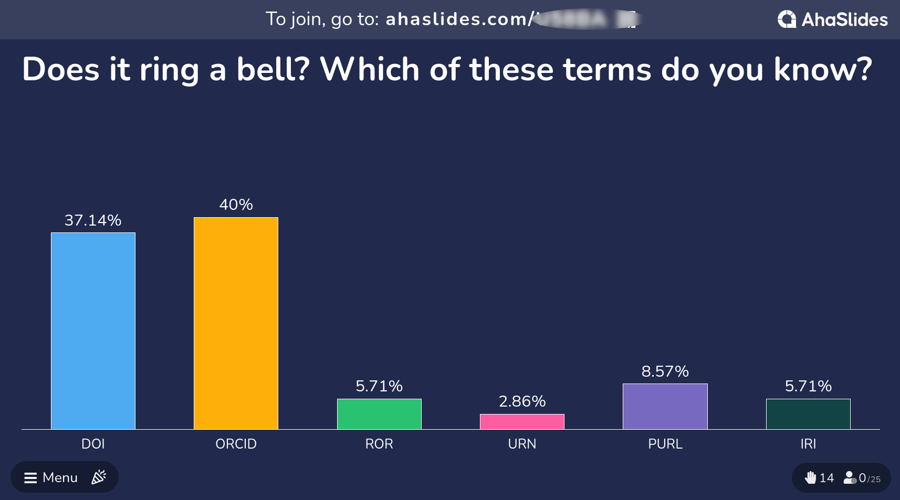
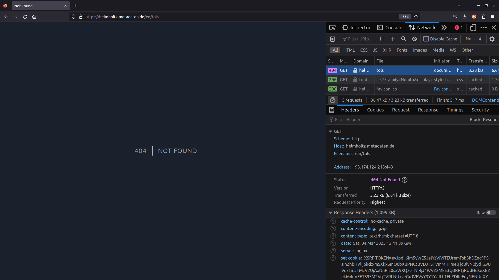
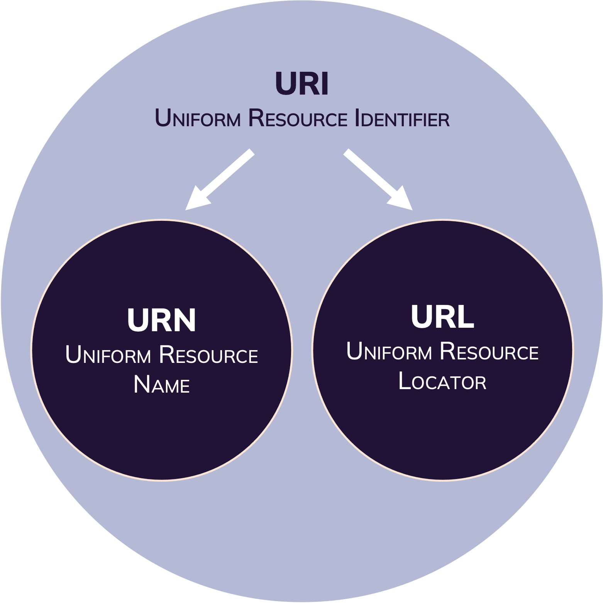
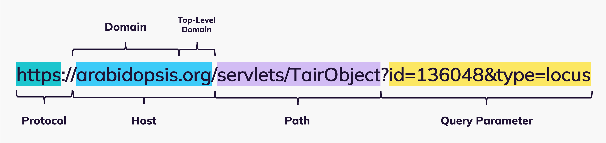

{alt="Quote from the Book Vanishing Act: The Erosion of Online Footnotes and Implications for Schlolarship in the Digital Age by Daniela Dimitrova and Michael Bugeja, saying 'Vanishing online footnotes undermine the building blocks of research, and their disappearance raises concerns about the reliability and replicability of scholarship.'"}
 

:::::::::::::::::::::::::::::::::::::: questions 

- What are PIDs?
- What are the differences between URL, URI and PID?
- Which PIDs are connected to the research context?

::::::::::::::::::::::::::::::::::::::::::::::::

::::::::::::::::::::::::::::::::::::: objectives

- Explain differences between URL, URI and PID(s)
- Name examples of PIDs relevant for the research context.

::::::::::::::::::::::::::::::::::::::::::::::::

## The Web of today

::::::::::::::::::::::::::::::::::::::::::::::::::::::::::::::::::::: instructor
## Group activity: PID poll

**Slide set**: -

**Time estimate**: 2 min

<i>Up to this point, the lesson followed a consistent silver lining. In the last episode, the learners "finished" annotating the example data. The following episode on (persistent) identifiers might seem somewhat disconnected to the previous lesson content at first before the connection is drawn to PIDs in metadata records. Therefore, we like to start off this episode with a quick live poll on PIDs in the scientific content. Together with the previous discussion on 404 Errors during the search for scientific metadata standards, this will prepare the learner for and engage them in the following content.</i>:smile:.

**Creators' recommendation:** 
We use [AHA slides](https://ahaslides.com/){target="_blank"} for live polling. Share the link to the poll with the learners and open the presentation mode of the poll on your shared screen. 

<u>QUESTION</u>  

1. Does it ring a bell? Which of these terms do you know?
    - DOI
    - ORCID
    - ROR
    - URN
    - PURL
    - IRI

<a href="../../docs/files/exampleAhaslidesPid.png" target="popup" onclick="window.open('../docs/files/exampleAhaslidesPid.png,'popup','width=1200'); return false;" onMouseOver="document.PIDpoll.src='../../docs/files/CLICKexampleAhaslidesPid.png';" onMouseOut="document.PIDpoll.src='../../docs/files/exampleAhaslidesPid.png';"></a>

(<i>As you can see in the example image above, DOI and ORCID are usually the best known PIDs among the learners. Take a few moments, to comment and reflect on the polling results.</i>)

::::::::::::::::::::::::::::::::::::::::::::::::::::::::::::::::::::::::::::::::

::::::::::::::::::::::::::::::::::::::::::::::::::::::::::::::::::::: instructor
## Lecture: Identifier & Web Locations

**Slide set**: <a href="../files/slideSet/IdentifierWebLocations_CarpentriesIncubator_ScientificMetadata.pdf" target="_blank" download>IdentifierWebLocations.pdf</a>

**Time estimate**: XX min

1. (<i>Bridge from polling results to "Identifier & Web Locations"</i>)
2. Remember the first lecture from yesterday? We have had a close look on the metadata in a book. Now if a librarian wants to identify a specific publication...
3. they will use its ISBN number for unambiguous identification. This ISBN number follows a standardized structure, which gives valuable information about the resource, such as the group and publisher of the book. This ISBN number is globally unique. Which means it only exists for one specific book and will always lead to the same result, whereever you retrieve it.
4. And these uniform resource identifiers also exist in the scientific context. Let me give you an example from molecular biology. Let's say, this scientist is working on genetics and is interested in the functions of a specific gene in the model plant...
5. <i>Arabidopsis thaliana</i>. Every gene in the genome / DNA is assigned a unique identifier that follows certain representation conventions. In the case of this model plant, the gene identifier holds information on the species, the chromosome, the type of sequence as well as its location on the chromosome. 
6. To generalize, unique identification codes enable globally unique and persistent identification of a resource. These codes follow conventions in their representation and are registered centrally, enabling a uniform structure of these identifiers globally or in the user community. This makes unique identification codes unambiguous and referencable.
7. (<i>Use this slide to collect unique identification codes in the research fields of the learners. We like to do this in a brief plenary discussion, asking the learners to share unique identifiers, they use regularly and what they represent.</i>)
8. Now we will take this concept of uniform identifiers to the web.
9. But first, we will need to define and distinguish between a few terms, that come up frequently in this context. The examples we have seen a couple of minutes ago, are - simply put - a series of structurally harmonized characters that uniquely identify a resource...
10. The gene identifier we have seen, is basically just a synonym for the gene, which is actually called SULFITE REDUCTASE. In the same sense, your Orcid is just a name for a metadata record describing your academic personality. This is, what we call a URN, Uniform Resource **Name**. We know, what the resource is called, but the name gives no clue, on how we can retrieve the information stored behind this name.
11. To do so on the web, we need the address...
12. where we can find the resource with a specific name. The address alone is not enough, though. We also need information on how we can retrieve the resource...
13. the communication protocol. We will focus on this technology in a minute. These information are given as a Uniform Resource Locator, URL: a series of characters, that specify the address of a resource and the protocol necessary to retrieve this resource.
14. Both, URN and URL, can be used to identify a specific resource. You either need the name or the location, to identify data on the web. So URN and URL **are** Uniform Resource Identifier.
15. We will further focus on URLs and the technology hidden behind this string of characters, that we enter to open a resource on the web.
16. And for this we take the URL that retrieves the information for our gene example.
17. So let's decode this character set: The resource we are looking for, is...
18. hosted on a specific server. On this server, a certain file path needs to be followed, that will lead to the resource. The final resource might be stored in a data base structure. So the necessary query parameter are specified that lead to the data base entry for the requested resource. And don't forget, we will need to follow a specific protocol, in this case HTTPS, in order to communicate with the host server. HTTPS is an extension of the Hypertext Transfer Protocol, that uses encryption technology for secure communication on the network.
19. If we now enter this URL in our browser, the browser sends a HTTP request to the server.
20. This request specifies, that the browser wants to **GET** a resource stored under a **specific path** from the **host** and follows the specific HTTP protocol that is used for communication, so which is also expected by the browser of the server response.
21. The host server than looks up the specified file path locally. Finds the requested file and...
22. sends back the HTTP response, with the requested resource.
23. The response also includes a status code. The code "200: ok" tells the client server, that send the request, "I have found the file you requested. Here you go!". There are various status codes for server-client communication, but for now, we will focus on the most common ones. The client, your browser, receives the response with the resource attached and..
24. displays it.
25. But I'm fairly sure, we have all experienced this situation: You are looking for publications online, be it data or a journal article. The abstract is super promising and you want to retrieve the PDF...
26. but instead of the publication, you are faced with an **Error 404**. 
27. So what happened here? You click on the link and the familiar HTTP request is send by your browser to the host server.
28. Again, the browser follows the file path but it is leading into the void. No file with this path. 
29. And this is, what the host server communicates back to your browser. The HTTP response now contains the status code **404 Not Found**. Let's take a look on this client-server communication in action.

::::::::::::::::::::::::::::::::::::::::::::::::::::::::::::::::::::::::::::::::

::::::::::::::::::::::::::::::::::::::::::::::::::::::::::::::::::::: instructor
# Guided confrontation: Error 404

**Time**: 2 min

**Narrative / Teaching script**:  
<ul>
  <li><i>Share an empty browser tab on your screen.</i></li> 
  <li><i>Open the network editor.</i> </li>
  <li><i>Open any desired website in your browser. This might be a good point to share your organizational, institutional, or personal homepage with the learners for some "hidden" marketing</i> :wink:.</li>
  <li><i>You can witness all the requests and responses in the network editor, while the page is loading</i>.</li>
  <li><i>Highlight that each element - html documents, images, etc - require individual requests in order to build the website and the `200: ok` status codes that are send back with the resources.</i></li>
  <li>**Optional:** <i>Take a closer look on the different status codes or the HTTP responses.</i></li>
  <li><i>Enforce an Error 404, e.g. by deleting one character in the file path. The status code 404 will appear in the status code column of the network editor.</i></li>
</ul>

<a href="../../docs/files/exampleError404.png" target="popup" onclick="window.open('../docs/files/exampleError404.png,'popup','width=1200'); return false;" onMouseOver="document.Error404.src='../../docs/files/CLICKexampleError404.png';" onMouseOut="document.Error404.src='../../docs/files/exampleError404.png';"></a>

::::::::::::::::::::::::::::::::::::::::::::::::::::::::::::::::::::::::::::::::

::::::::::::::::::::::::::::::::::::::::::::::::::::::::::::::::::::: instructor
## Lecture: Persistent Identifiers

**Slide set**: <a href="../files/slideSet/PersistentIdentifier_CarpentriesIncubator_ScientificMetadata.pdf" target="_blank" download>PersistentIdentifier.pdf</a>

**Time estimate**: XX min

1. Simplified, there could be two reasons, why you end up with a 404 status code: Either you can't spell, or the resource path is broken.
2. How do path's break.
3. The URL you want to retrieve points to specific resources, stored on the server. But within the life cycle of an online resource, several events can take place.
4. The file path on the host server might change, the resource might be migrated to a different host server, or the resource might simply be deleted. In any of these cases, the URL does not specify the exact location of the resource any longer and will no longer be retrievable by the server adressed by the GET-request you send from your browser. This process is also referred to as "link rot". Remember, that we classified the URL as a form of Uniform Resource Identifier? This means, that link rot leads results in the resource loosing a very important identifier!
5. Web technology has a solution for this issue: Persistent Identifiers or short, PIDs.
6. Like our other persistent and unique identifiers, such as ISBN numbers, PIDs are long-lasting references to digital objects on the web. Any resource that has a representation on the web - articles, datasets, persons, instruments - can have a PID assigned. These PIDs remain constant over time, lead directly to the resource - so they also give information on the location and protocol - and, thus, ensure permanent identifiability, refencabilty and retrievability of online resources.
7. The technology behind PIDs is fairly simple. In PID databases, a PID is mapped to a URL, that retrieves a resource. Even though the URL changes, due to server migration or changes in the file path, the PID remains consistent.
8. If you activate a hyperlink in your browser to retrieve a resource without a PID service included, your browser will directly communicate with the host server to retrieve a resource.
9. If the requested resource is identified by a PID, the underlying PID service will be contacted by the browser. The PID service will then query its database for the PID, identify the current URL of the resource and redirect the request to the host server.
10. So when the location of the resource changes...
11. a PID will not lead to unretrievable resources and rotten links...
12. as the new URL is stored in the PID database and the activated link will redirect the request to the new location.
13. It is important to know, that the PID service **only** provides the **technical infrastructure** for redirections. The owner of the server of the requested resource - which could be a private person, a journal that published an article or a repository that holds a dataset - **is responsible for updating the URL**. For example: You publish an article and one of the journals features is that they assign a DOI to this article. If the journal now changes the digital location of your article on their server, the journal is responsible to inform the PID provider - DOI - about the changes and update the location.
14. As we have seen in our poll at the beginning of this lecture, many of you are already familiar with Digital Object Identifiers and ORCIDs. Other PIDs that are frequently used in the scientific context are Persistent Uniform Resource Locators, RORs - the Research Organization Registry, and ARKS - Archival Resource Keys.
15. <i>allow for some time for questions</i>

::::::::::::::::::::::::::::::::::::::::::::::::::::::::::::::::::::::::::::::::

Built for human understanding: even though web documents are made with computers, computers can NOT understand the content of these documents. **They can't read, see relationships or make decisions like humans can.**

Most search engines are based on keywords:
<ul>
  <li>results are high recall and low precision</li>
  <li>results are highly sensitive to vocabulary</li>
  <li>results are single human-readable web pages</li>
  <li>**results do not support logical reasoning and query answering**</li>
</ul>

The World Wide Web is a hypermedia system. It contains:

**Resources**
A web resource is any identifiable resource present on or connected to the World Wide Web.
A resource can be anything that has identity.

**Links**
(Web identifiers) between these resources.

## Web Identifiers

:::::::::::::::::::::::::::::::::::::::::::::::::::::::::::::::::::::::: callout
## Unique Identifiers

etwas generelles über unique identifiers
::::::::::::::::::::::::::::::::::::::::::::::::::::::::::::::::::::::::::::::::

 

The **Uniform Resource Identifier (URI)** is a string of characters formulated to uniquely identify a resource, (most commonly on the Web) and enable interaction with it via common protocols such as HTTP.

A **Uniform Resource Name (URN)** is a type of URI. It is a standard, persistent and unique identifier for digital resources on the Internet. To link to the resource from the URN, a **resolver service is required.**

The **Uniform Resource Locator (URL)** is a string of characters used to access the information or resource by **using the address of the resource location** via communication protocols such as HTTP. 
  

:::::::::::::::::::::::::::::::::::::::::::::::::::::::::::::::::::::::: callout 
## How links rot

{alt="Examplary representation of the URL syntax: protocol specification, host adress, file path and query parameters."}

The **URL** specifies the exact location of a retrievable resource on the web (host & path) as well as the communication protocol (e.g. HTTP) necessary for the local browser to address the host server.
If you open a link on the web operated under the HTTP protocol, the browser sends a **GET request** to the host server, specifying the path to the requested resource. The host server then follows this path and responds with the resource information, if retrievable.

A resource might **not be retrievable** by the host server, if:
<ul>
  <li> the location was misspelled.</li>
  <li> the file path on the host server changed.</li>
  <li> the resource was deleted.</li>
  <li> the resource was migrated to a different server.</li>
</ul>

Each of these events will result in the **404 error** response. To avoid these broken or rotten links, assigning a **Persistent Identifier (PID)** to the resource resolves the issue.

::::::::::::::::::::::::::::::::::::::::::::::::::::::::::::::::::::::::::::::::

A **Persistent Identifier (PID)** is a long-lasting reference to digital objects such as websites, articles, datasets, persons or organizations. PIDs are **globally unique** and **persistent over time**. Assigning a PID to a digital resource ensures its permanent indentifiability, accessibility, and referenciability.[^16]   

:::::::::::::::::::::::::::::::::::::::::::::::::::::::::::::::::::::::: callout
## PID services

A **PID service** operate as a persistent look-up service that redirects GET requests for digital resources to the latest URL of this resource. 
**The host of the digital resource is responsible for updating the resource's location wiith the PID service after the location changed.**   

**Frequently used PIDs in the scientific context are:**
<ul>
  <li>Digital Object Identifier (<a href="https://www.doi.org/index.html" target="_blank">DOI</a>)</li>
  <li>Persistent Uniform Resource Locator (PURL, e.g. <a href="https://purls.helmholtz-metadaten.de/" target="_blank">PIDA</a>)</li>
  <li>International Standard Book Number (<a href="https://www.isbn-international.org/content/what-isbn" target="_blank">ISBN</a>)</li>
  <li>Open Researcher and Contributor ID(<a href="https://orcid.org/0000-0002-1825-0097" target="_blank">ORCID</a>)</li>
  <li>Research Organization Registry(<a href="https://ror.org/" target="_blank">ROR</a>)</li>
</ul>

::::::::::::::::::::::::::::::::::::::::::::::::::::::::::::::::::::::::::::::::

## Web Locations and Scientific (Meta)data

::::::::::::::::::: callout

:construction: **UNDER CONSTRUCTION** :construction:

:::::::::::::::::::::::::::

::::::::::::::::::::::::::::::::::::::::::::::::::::::::::::::::::::: instructor
## Lecture: PIDs and metadata records

**Slide set**: <i>WILL BE ADDED LATER</i>

**Time estimate**: XX min

:construction: **UNDER CONSTRUCTION** :construction:

IN THIS LECTURE WE WILL FOCUS ON:
<ul>
  <li>Assigning (meta)data publications with PIDs</li>
  <li>URLs as data values</li>
  <li>Why you should have an ORCID Id</li>
  <li>referencing metadata standard properties</li>
</ul>

::::::::::::::::::::::::::::::::::::::::::::::::::::::::::::::::::::::::::::::::

### Making your data retrievable

### PIDs as metadata values
PIDs referencing i.e. digital objects (DOIs), persons (e.g. ORCID iD) or institutions (ROR) can be used to uniquely identify properties of a metadata record.

### PIDs as metadata properties

::::::::::::::::::::::::::::::::::::: keypoints 

- Use `.md` files for episodes when you want static content
- Use `.Rmd` files for episodes when you need to generate output
- Run `sandpaper::check_lesson()` to identify any issues with your lesson
- Run `sandpaper::build_lesson()` to preview your lesson locally

::::::::::::::::::::::::::::::::::::::::::::::::
[^16]: John Kunze (2018). "Ten persistent myths about persistent identifiers". https://escholarship.org/uc/item/73m910w8
