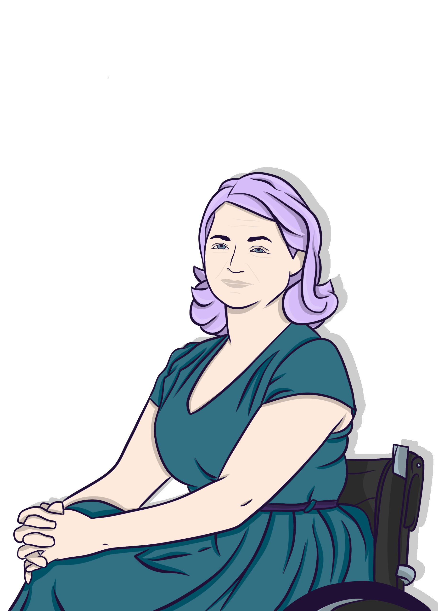

<h4 style="display:flex;">Berni Hughes</h4>
Berni is a first-year PhD candidate in computer science. She is really excited about her new research topic: deep learning and computer vision. To kick-off her project, she attends a variety of classes focusing on good scientific practice and research data management. Her supervisor recommended her to take a class on scientific data annotation and metadata.  
Berni is fluent in C++, JavaScript and Python. She is familiar with the structure of markup such as XML, YAML and JSON, yet she is new to annotating her scientific work with metadata and looking for solutions to validate her metadata objects.

{height=300px class="figure mx-auto d-block"}

 

{height=300px class="figure mx-auto d-block"}

<h4 style="display:flex">Robert Medina</h4>
Robert earned his PhD in biochemistry and currently holds a postdoc position in a biotechnology lab. In his research he conducts multiple proteomic studies, resulting in large amounts of data.  
While writing his PhD thesis, Robert got frustrated about his own experiment documentation and realized how hard it is to remember details and protocols of experiments that date back three years and longer. This motivated him to change his documentation and data annotation habits. 
Robert analyzes his data in MS Excel and basic R-scripts, he has never heard about XML, YAML or JSON.

 

<h4 style="display:flex">Linda Sievers</h4>
Linda is a mechanical engineer who recently joined the research data management (RDM) department of a large research institute as a data steward. Previously, she gained several years of experience in R&D and consulting, in both academic as well as corporate contexts. 
Fairly new to the topic, Linda currently works her way through literature on RDM. She is familiar with the FAIR principles on a theoretical level, but wants to gain more experience on the application level. Additionally, Linda is keen on getting to know helpful tools and resources for research metadata handling, which could make her, her colleagues', and her stakeholder's work life easier. 
{height=300px class="figure mx-auto d-block"}

